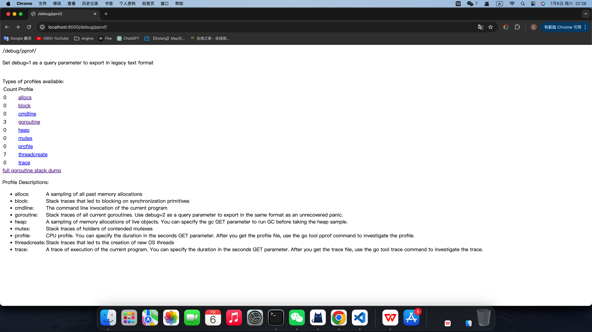
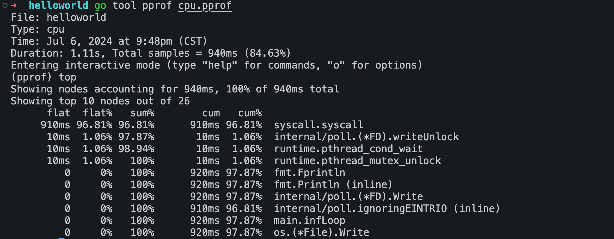
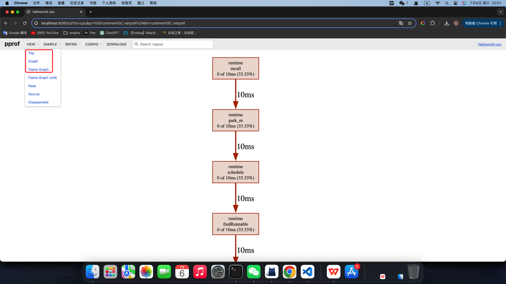

# pprof
写了很多代码 结果性能不佳？
- runtime/pprof：采集程序（非 Server）的运行数据进行分析
- net/http/pprof：采集 HTTP Server 的运行时数据进行分析

# runtime/pprof
```go
package main

import (
	"fmt"
	"os"
	"runtime/pprof"
	"time"
)

func main() {
	f, err := os.Create("cpu.pprof")
	if err != nil {
		panic(err)
	}
	defer f.Close()

	pprof.StartCPUProfile(f)
	defer pprof.StopCPUProfile()
	go infLoop()
	time.Sleep(time.Second * 10)
}

func infLoop() {
	for {
		fmt.Println("abcd")
	}
}
```

# net/http/pprof 
```go
package main

import (
    "net/http"
    _ "net/http/pprof"
)

func main() {
    http.HandleFunc("/", func(resp http.ResponseWriter, req *http.Request) {
        resp.Write([]byte("hellp net pprof"))
    })
    err := http.ListenAndServe("127.0.0.1:8000", http.DefaultServeMux)
    if err != nil {
        panic(err)
    }
}
/* 可以设置路由
http.HandleFunc("/debug/pprof/", Index)
http.HandleFunc("/debug/pprof/cmdline", Cmdline)
http.HandleFunc("/debug/pprof/profile", Profile)
http.HandleFunc("/debug/pprof/symbol", Symbol)
http.HandleFunc("/debug/pprof/trace", Trace)
*/
```
```bash
go run . 
# pprof http://127.0.0.1:8000/debug/pprof/
```
> 推荐使用 http 

# Graphviz
Graphviz 是一个开源的图可视化工具，非常适合绘制结构化的图标和网络。Graphviz 使用一种叫 DOT 的语言来表示图形。直接去http://www.graphviz.org/安装即可。
```bash
brew install graphviz
```
# pprof http界面

- allocs	程序运行到现在的内存申请情况
- block	处于阻塞的协程的栈帧，默认不开启，需要调用runtime.SetBlockProfileRate来开启
- goroutine	全部协程的栈帧。使用?debug=2会展示更详细的信息（例如goroutine状态）
- heap	堆上对象的内存申请情况
- mutex	mutex的竞争状态，默认不开启， 需要调用runtime.SetMutexProfileFraction来开启
- profile	cpu 状态，采样完成后，使用go tool pprof来分析
- threadcreate	系统线程的创建情况
- trace	程序的追踪状态


## pprof 命令
```bash
# pprof 采集
go tool pprof http://localhost:6060/debug/pprof/profile\?seconds\=60
go tool pprof http://localhost:6060/debug/pprof/heap
# pprof 可视化
go tool pprof -http=:8080 cpu.prof
# pprof 终端交互
go tool pprof  cpu.prof
```



top命令
- flat	当前函数占用的cpu时间（因为这里分析的是cpu，所以单位是时间单位，在分析内存时单位就会换成空间单位）
- flat%	当前函数占用的cpu时间百分比
- sum%	flat%从上到下依次累加的结果，所以第一行的sum%会等于第一行的flat%，而第二行的sum%就会是第一行的flat%加第二行的flat%，后边依次类推
- cum	cumulative，当前函数及当前函数的子函数占用的cpu时间
- cum%	当前函数及当前函数的子函数占用的cpu时间百分比
(最后一列)	函数的路径，格式为Package.{Function}

其他常用命令 help查看
> svg（建议）、png、pdf、ps、dot

## 
管道形式`go tool pprof cpu.pprof | dot -Tpng -o cpu.png`

# 图形化查看
```bash
go tool pprof -http=:6789 http://localhost:6060/debug/pprof/profile\?seconds\=60
```


比较重要的几个页面：Top、Graph、Flame Graph(火焰图)、Source