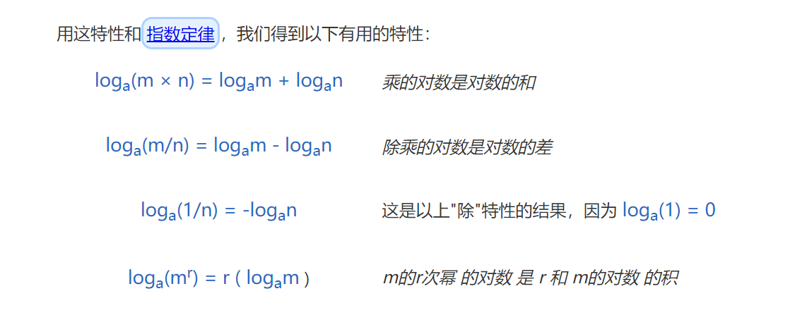

:point_right:毒鸡汤：车马春山慢慢行

:point_right:数据结构的存储方式只有两种：数组（顺序存储）和链表（链式存储）。

- 数组：由于是紧凑连续存储,可以随机访问，通过索引快速找到对应元素，而且相对节约存储空间。但正因为连续存储，内存空间必须一次性分配够，所以说数组如果要扩容，需要重新分配一块更大的空间，再把数据全部复制过去，`时间复杂度 O(N)`；而且你如果想在数组中间进行插入和删除，每次必须搬移后面的所有数据以保持连续，时间复杂度 O(N)。
- 链表：因为元素不连续，而是靠指针指向下一个元素的位置，所以不存在数组的扩容问题；如果知道某一元素的前驱和后驱，操作指针即可删除该元素或者插入新元素，时间复杂度 O(1)。但是正因为存储空间不连续，你无法根据一个索引算出对应元素的地址，所以不能随机访问；而且由于每个元素必须存储指向前后元素位置的指针，会消耗相对更多的储存空间。

> :point_right:对于任何数据结构，其基本操作无非`遍历` + `访问`，再具体一点就是：`增删查改`。

## :point_right:对数函数



> 没有处理 loga(m+n) 或 loga(m−n)的规则
>
> `a^x = b  ->  x = loga(b) 
>
> log10(x)，通常写为 log(x)
>
>  loge(x),通常写为 ln(x)

## :point_right:渐进符号

渐进符号如下：

```bash
`O`，`ο`，`Θ`，`Ω`，`ω`
```

分别读作：Omicron（大欧），omicron（小欧），Theta（西塔），Omega（大欧米伽），omega（小欧米伽）。

| 记号 | 含义       | 理解       |
| ---- | ---------- | ---------- |
| Θ    | 紧确界     | 相当于"="  |
| O    | 上界       | 相当于"<=" |
| ο    | 非紧的上界 | 相当于"<"  |
| Ω    | 下界       | 相当于">=" |
| ω    | 非紧的下界 | 相当于">"  |

> 一般使用O

## 算法复杂度

复杂度有两个维度：时间和空间。我们说，一个实现了某算法的程序：

- 如果计算的速度越快，那么这个算法时间复杂度越低。
- 如果占用的计算资源越少，那么空间复杂度越低。

算法的优先级排列如下，一般排在上面的要优于排在下面的：

- 常数复杂度：`O(1)`
- 对数复杂度：`O(logn)`
- 一次方复杂度：`O(n)`
- 一次方乘对数复杂度：`O(nlogn)`
- 乘方复杂度：`O(n^2)`，`O(n^3)`
- 指数复杂度：`O(2^n)`
- 阶乘复杂度：`O(n!)`
- 无限大指数复杂度：`O(n^n)`

## :point_right:P、NP、NPC、NP-hard问题

类似于 `O(1)`，`O(logn)`，`O(n)` 等复杂度，规模 `n` 出现在底数的位置，计算机能在多项式时间解决，我们称为**多项式级的复杂**。

类似于 `O(n!)`，`O(2^n)` 等复杂度，规模 `n` 出现在顶部的位置，计算机能在非多项式时间解决，我们称为**非多项式级的复杂度**。

- `P` （Polynominal）问题： 如果一个问题，可以用一个算法在多项式时间内解决 。比如求1加到100的总和，它的时间复杂度是 `O(n)`，是多项式时间。
- `NP` 问题：有些问题，只能用枚举的方式求解，时间复杂度是指数级别，非多项式时间但是只要有一个解，我们能在多项式时间验证这个解是对的。
- `NPC` 问题：存在这样一个 `NP` 问题，所有的 `NP` 问题都可以约化成它。换句话说，只要解决了这个问题，那么所有的 `NP` 问题都解决了。
  - 它得是一个 `NP` 问题。
  - 所有的 `NP` 问题都可以约化到它。
- `NP-hard` 问题：
  - 所有的 `NP` 问题都可以约化到它。
  - 它不是一个 `NP` 问题。
  - `NP-hard` 问题更难，你只要解决了 `NP-hard` 问题，那么所有的 `NP` 问题都可以解决。


> 所有的 `P` 问题都是 `NP` 问题。
>
> 我们一旦发现一个问题是 `NPC` 问题，那么我们很难去准确求出其解，只能暴力枚举，靠猜。


